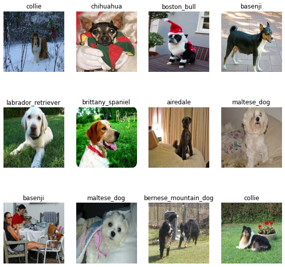

# Capstone Project3 - Establishing Images Classification System by Convolutional Neural Network(CNN)

## Project Description:
This project established and compared 3 CNN model for classifying 20 dog breeds from their image. The relevant documents are as followed:
1. [Capstone Project III Final Report](https://github.com/ronald55699/Capstone-Project-3-Establishing-Images-Classification-System-by-Convolutional-Neural-Network-CNN-/blob/main/Report/Capstone%203%20Final%20Report.pdf) 
2. [Capstone Project III Final Presentation](https://github.com/ronald55699/Capstone-Project-3-Establishing-Images-Classification-System-by-Convolutional-Neural-Network-CNN-/blob/main/Report/Capstone%203%20Presentation.pdf)
